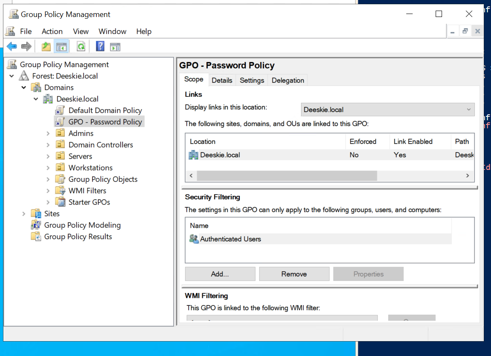

## Group Policy Configuration

The screenshot below shows the Group Policy structure and organizational units (OUs) configured within the Active Directory domain `deeskie.local`.

Group Policy provides a centralized mechanism for managing configurations and security settings across all domain-joined computers and users in the enterprise lab environment.

The Group Policy infrastructure enables:

- Centralized configuration management across all domain computers
- User and computer policy enforcement through Group Policy Objects (GPOs)
- Security policy application and compliance enforcement
- Software deployment and updates across the enterprise
- User rights and permissions management
- Password policy and account lockout configuration
- Network and firewall settings standardization

The Group Policy structure organizes resources through organizational units (OUs) that allow granular policy application to specific groups of computers and users. This hierarchical approach ensures efficient management and targeted policy enforcement throughout the domain.

The Group Policy implementation was validated by confirming:
- Successful policy application to domain-joined computers
- Proper organizational unit (OU) hierarchy structure
- Group Policy Objects (GPOs) linked to appropriate containers
- Event log confirmation of policy processing
- User and computer settings enforcement across the domain
- Proper security group filtering for policy scope

